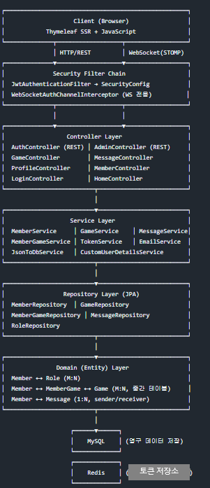
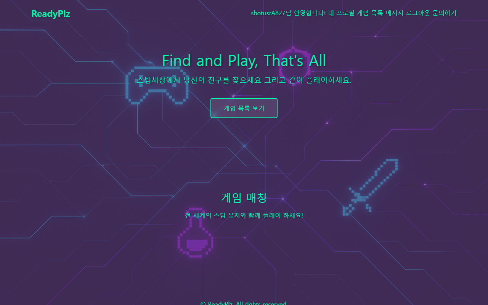
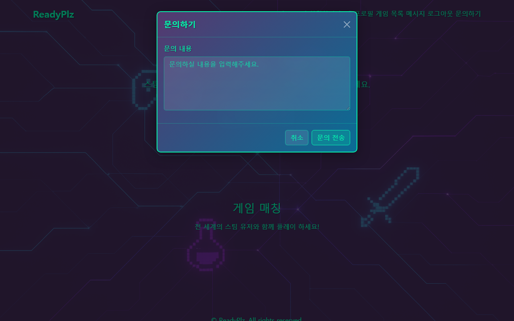
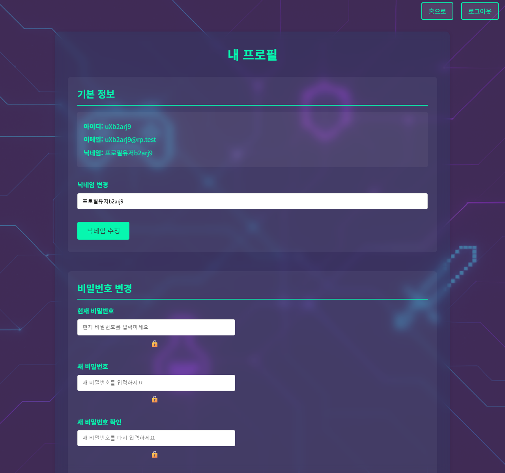

[메인으로 돌아가기](../README.md)

# 1.웹앱 흐름 및 아키텍처 개요

## 1.1 시스템 아키텍처 다이어그램 (System Architecture)
계층(Layer) 간의 의존성은 아래와 같이 분리설계 하였습니다. 
 

 
 

## 1.2 계층별 역할 (Layer Details) 
  (1). Client Layer 
서버 사이드 렌더링(SSR)을 통해 초기 로딩 속도 향상을 의도했습니다. 
 
  (2). Security Layer (보안 및 인증)  
HTTP 요청: SecurityConfig에 등록된 JwtAuthenticationFilter(`CsrfFilter` 앞)가 토큰을 검사하고 SecurityContext에 인증 객체를 저장합니다. Cookie CSRF는 `NonClearingCookieCsrfTokenRepository` + `CsrfCookieFilter`로 `XSRF-TOKEN`을 유지·발급합니다.  
WebSocket 요청: STOMP 프로토콜 연결 시 WebSocketAuthChannelInterceptor가 개입하여, 소켓 세션이 맺어지기 전 쿠키 기반 JWT를 검증함으로써 허가되지 않은 사용자의 알림 연결을 차단합니다.  
 
  (3). Controller Layer (표현 계층) 
클라이언트의 요청을 받아 해당 Service로 위임하고, 결과를 View나 JSON 형태로 반환합니다. 
AuthController, LoginController: JWT 발급 및 로그인 화면 
GameController, MemberController: 게임 컬렉션·회원가입/비밀번호 재설정 화면 
ProfileController: 프로필·닉네임·비밀번호 변경·계정 삭제 
MessageController: HTTP 기반 1:1 메시징 (`POST /messages/send` 등). 실시간 알림만 `MessageService`가 STOMP로 push 
AdminController: JSON 게임 적재 (`POST /admin/db/load-json-games`) 
HomeController, HealthController: 홈(`/`, `/home`)과 ELB 헬스(`GET /health`) 
 
  (4). Service Layer (비즈니스 로직 계층) 
트랜잭션(@Transactional) 경계를 설정하고 예외 처리를 담당합니다. 
CustomUserDetailsService: Spring Security 인증 시 DB에서 유저 정보를 로드합니다. 
TokenService: Redis에 Access/Refresh 활성 토큰과 블랙리스트를 저장·조회합니다. 토큰 발급·갱신 HTTP 흐름은 `AuthController`가 담당합니다. 
JsonToDbService + GameImportBatchService: 관리자(Admin)가 JSON에서 게임 데이터를 읽어 배치 적재합니다. 
EmailService: 비밀번호 재설정 메일을 `@Async`로 발송합니다. 
 
  (5). Repository & Domain Layer (데이터 접근 및 도메인 계층) 
Spring Data JPA를 사용하여 데이터베이스 접근 로직을 추상화하고, 객체 지향적인 도메인 모델을 구축했습니다. 
 
  (6). Database Layer 
MySQL: 회원 정보, 게임 리스트, 1:1 메시지 내역 등 영구적으로 보존되어야 하는 데이터를 관리합니다. 
Redis (In-Memory DB): 휘발성이 강하고 I/O 속도가 빨라야 하는 JWT 활성 토큰(Access/Refresh) 및 블랙리스트(로그아웃 처리)를 관리하여 DB의 부하를 줄입니다. WebSocket 세션 저장용이 아닙니다.
 
 
엔티티 매핑 관계 (ERD 구조)  
Member ↔ MemberGame ↔ Game (M:N 해소): 회원이 선택한 플레이 게임 목록을 관리하기 위해, MemberGame이라는 중간 엔티티를 두어 다대다 관계를 일대다/다대일/일대다 관계로 안전하게 풀었습니다. 
Member ↔ Message (1:N): 하나의 회원은 송신자(Sender) 또는 수신자(Receiver)로서 여러 메시지를 가질 수 있습니다.
 
 

## 1.3 USER 계정 흐름 
[회원가입]
  Client → POST /api/auth/register (MemberForm)
    → 입력 검증 (Bean Validation)
    → 중복 검사 (username, email, nickname)
    → BCrypt 비밀번호 암호화
    → ROLE_USER 자동 부여
    → DB 저장
    → 자동 로그인 (JWT 발급 → HttpOnly Cookie 설정)
  
[로그인]
  Client → POST /api/auth/login (username, password)
    → AuthenticationManager 인증
    → Access Token (1시간) + Refresh Token (7일) 생성
    → Redis에 토큰 저장
    → HttpOnly Cookie로 클라이언트에 전달
  
[토큰 갱신]
  Client → POST /api/auth/refresh (refreshToken Cookie)
    → Refresh Token 검증 + Redis 저장값 비교
    → 새로운 Access/Refresh Token 발급 (Token Rotation)
    → Redis 갱신 + Cookie 재설정
  
[로그아웃]
  Client → POST /api/auth/logout
    → Access Token·Refresh Token 블랙리스트 등록 (Redis)
    → 사용자 활성 토큰 키 삭제 (Redis)
    → Cookie 삭제 (maxAge=0)
  
[매 요청마다]
  JwtAuthenticationFilter가 쿠키/헤더에서 JWT 추출
    → 블랙리스트 확인 → 토큰 검증 → SecurityContext 설정

## 1.4 USER 계정 기능
**로그인 후 홈(`/`, `/home`)에서 게임 목록·메시지·프로필로 진입합니다.**
 

 
 
 

**[게임 컬렉션 관리]**  
  GET /games/collection
    → 내 게임 목록 조회
    → 게임 검색 (Steam DB 기반, 페이징)
    → 같은 게임을 가진 다른 유저 조회 (DTO 프로젝션으로 N+1 방지)
  POST /games/collection/add-game
    → 최대 5개 제한 검증 → MemberGame 생성/저장
  POST /games/collection/remove-game
    → MemberGame 관계 삭제

 
  
  
**[메시징]**
 
  GET /messages
    → 대화 목록 조회 (상대방, 마지막 메시지, 읽지 않은 수)
    → ROLE_ADMIN 계정은 대화 목록에서 필터링
     
  GET /messages/{otherMemberId}
    → 특정 상대와의 대화 내역 조회 (페이징)
     
  POST /messages/send
    → 메시지 전송 (대화 상대별 1000개 제한, 초과 시 해당 대화의 오래된 10개 자동 삭제)
     
  GET /messages/game/{gameId}/users
    → 특정 게임의 다른 유저 목록 조회 (자신 제외)

 

 
 

**[문의하기]**
 
  POST /messages/inquiry
    → ADMIN 계정을 자동으로 찾아서 "[문의]" 접두사와 함께 메시지 전송

 
 

**[프로필 관리]**
 
  GET /members/profile → 프로필 페이지 (내 게임, 닉네임 등)   
  POST /members/profile/confirm-nickname → 닉네임 변경 확인 페이지  
  POST /members/profile/update-nickname-confirmed → 닉네임 변경 확정 (중복 검증)  
  POST /members/profile/change-password → 비밀번호 변경 (현재 비밀번호 확인)  
  POST /members/profile/delete-account → 계정 삭제 (비밀번호 + 이메일 확인)  

 
 

**[비밀번호 재설정]**
 
  POST /members/reset-request → 이메일로 재설정 링크 발송 (비동기)  
  GET  /members/reset-password?token=... → 토큰 검증 후 재설정 페이지  
  POST /members/reset-password → 새 비밀번호 저장  

## 1.5 ADMIN 계정 흐름
접근 제어:  
SecurityConfig에서:  
.requestMatchers("/admin/**").hasRole("ADMIN") 
 
AdminController에서:  
  @PreAuthorize("hasRole('ADMIN')")  (클래스 레벨) 

## 1.6 ADMIN 계정 기능
(1). 게임 데이터 로드   
POST /admin/db/load-json-games
  → JsonToDbService.saveDataFromJsonFile()
    → classpath:steam_games_data.json 파일 읽기
    → JSON 파싱 (appid, name, headerImage, releaseDate)
    → 배치 처리 (1000개 단위)
      → 기존 DB 중복 확인 (appid, 이름은 대소문자 무시 — MySQL utf8mb4_unicode_ci unique와 맞춤)
      → 신규 게임만 Game 엔티티로 변환 후 저장
    → 결과 로깅 (저장/건너뜀/유효하지않음 카운트)

 
 
(2). USER 문의 수신  
사용자가 POST /messages/inquiry 호출 시
  → MemberService.findAdminMember()로 ADMIN 계정 자동 탐색
  → ADMIN에게 "[문의] ..." 형태의 메시지 전송
  → ADMIN은 일반 메시지 시스템을 통해 문의 확인 및 답변 (일반 사용자의 대화 목록에서 ADMIN과의 대화는 자동으로 제외됩니다.)

