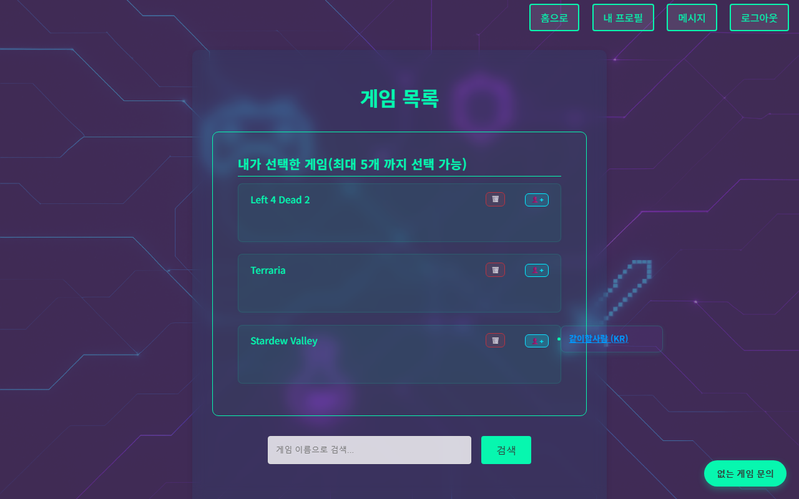

[메인으로 돌아가기](../README.md)

## 상세 문서
*아래 링크를 클릭하시면 해당 상세 페이지로 이동합니다.*

#  2. 주요 기능
컬렉션·1:1 메시지·실시간 알림 화면 (상세설명은 아래 2.5와 <a href="./01-architecture.md">1장 아키텍처</a>를 참고하세요.)
 
 

 

 
 

### [2.1 JWT를 통한 로그인 시스템과 Access/Refresh 이중 토큰 전략 사용](./2.1-jwt_double_token.md)
 

### [2.2 JWT 관련 정보를 저장하는 In-Memory DB인 Redis 사용](./2.2-redis_jwt.md)
 

### [2.3 JWT 특성에 맞춰 커스텀한 Spring Security 기반 인증/인가 처리](./2.3-jwt_spring_security.md)
 

### [2.4 이메일 비밀번호 재설정 기능](./2.4-email_reset.md)
 

### [2.5 WebSocket을 통한 실시간 알림 및 STOMP 사용자별 라우팅](./2.5-websocket_chat.md)
