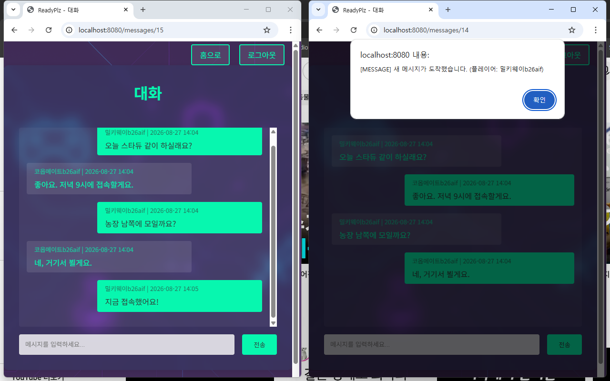

[메인으로 돌아가기](../README.md)

# 3. 기술적 고민 및 아키텍처 결정

## 3.1 JWT 사용 이유와 Redis와의 조합

**JWT 채택 배경:**
- 훗날 네이티브 모바일 앱 환경으로의 확장을 고려하여 수평적 확장에 적합한 인증 방식인 JWT 방식을 채택했습니다.
- Stateless 상태를 지향해 네트워크 통신 비용을 낮추고, 사용자 증가 시 발생하는 HttpSession 방식의 병목 현상을 해결할 수 있습니다.
- API 통신에 최적화된 JWT를 사용하여 프론트엔드와 백엔드의 분리 및 독립적 개발을 가능하게 하였습니다.

**Q. JWT도 결국 Redis에 저장한다면 세션 방식과 다른 점이 없지 않은가?**
 
  A. 중요한 차이는 저장해야 하는 데이터의 양과 범위입니다. 세션 방식은 활성화 되어 있는 모든 사용자의 세션 데이터를 서버에 저장 및 관리해야 하므로, 사용자가 증가할수록 메모리 사용량이 비례하여 증가합니다.
 반면 JWT+Redis 조합은 블랙리스트(무효화된 토큰) 와 사용자당 토큰 참조값(access_token:{username})만 저장하므로 저장 규모가 훨씬 작습니다.
 또한 JWT 자체에 사용자 정보와 권한(Claims)이 포함되어 있어, 정상 요청 시에는 서명과 검증만으로 인증이 완료되고 블랙리스트 확인은 Redis 조회 한 번으로 최소화됩니다.
 완전한 Stateless는 아니지만, 세션 방식 대비 서버 부담이 적고 수평 확장에 적합하다고 생각하여 JWT방식을 채택한 것입니다.
 
**Redis 이중 토큰 전략:**
- Redis의 빠른 속도와 `TTL(Time To Live)` 기능은 JWT 유효성 검증과 만료 시간 관리에 최적의 시너지를 제공합니다.
- Access/Refresh 이중 토큰 전략을 사용하여 탈취 리스크를 감소시켰습니다. 탈취가 의심되는 토큰은 블랙리스트에 올려 인증을 차단합니다.
- Refresh Token Rotation 전략: 토큰 갱신 시 Refresh Token도 함께 재발급하여, 이전 Refresh Token을 즉시 무효화합니다.  
만약 탈취된 이전 토큰으로 갱신을 시도하면 Redis에 저장된 토큰과 불일치하여 거부되므로, 토큰 재사용을 불가능하게 합니다.
---

## 3.2 Spring Security와 JWT 인증/인가 흐름

- **흐름**: `CORS` → `JwtAuthenticationFilter`(`CsrfFilter` 앞) → `CsrfFilter`(Cookie CSRF 활성, `/api/**`만 예외) → `CsrfCookieFilter`(`BasicAuthenticationFilter` 뒤) → `ExceptionTranslationFilter` → `FilterSecurityInterceptor` → `Controller`
- CSRF: `NonClearingCookieCsrfTokenRepository`(내부적으로 `CookieCsrfTokenRepository.withHttpOnlyFalse()`)로 활성. Access Token을 쿠키로도 쓰므로 SSR 폼·`/admin/**` 등 쿠키 인증 POST는 `X-XSRF-TOKEN`(또는 폼 `_csrf`)이 필요하고, REST `/api/**`만 `ignoringRequestMatchers`로 검사에서 제외합니다.
- JWT `STATELESS`에서는 요청마다 인증이 다시 적용되어 기본 `CsrfAuthenticationStrategy`가 `saveToken(null)`로 `XSRF-TOKEN`을 지웁니다. 저장소가 null 저장을 무시하고, `CsrfCookieFilter`가 deferred 토큰을 GET에도 쿠키로 내려줍니다.
- JWT를 CSRF보다 앞에 두는 이유: CSRF가 먼저 실패하면 SecurityContext가 비어 `AuthenticationEntryPoint`가 `/members/loginForm`으로 리다이렉트합니다. 닉네임 수정 등 SSR POST가 로그아웃처럼 보이는 현상을 막기 위함입니다.
- 로그인 시 FormLogin은 사용하지 않습니다. 요청마다 토큰 검증 → 인증 성공 시 SecurityContext 주입 → 인가 처리를 거칩니다.

## 3.3 SMTP를 활용한 비밀번호 재설정

**로컬과 운영 포트:**
저장소의 `application.properties` 기본값은 로컬 메일 캡처용 `localhost:1025`(인증·STARTTLS 없음)입니다. 운영에서는 포트 25가 차단·비암호화되고, 465는 무조건 SSL/TLS입니다. 실제 발송 환경에서는 **포트 587 + STARTTLS**로 평문 시작 후 필요 시 암호화 채널로 올리는 구성을 사용합니다.

**보안 및 최적화:** 
 
(1) 타이밍 기반 추정 방지: 이메일이 DB에 존재하지 않을 경우 처리가 빠르게 끝나 응답 시간 차이로 이메일 등록 여부가 추정될 수 있습니다.
   이를 방지하기 위해 "finally" 블록에서 BCrypt 해시 연산을 수행하여, 이메일 존재 여부와 관계없이 응답 시간을 균일하게 만들었습니다.

(2) 비동기 처리(@Async): 이메일 전송 시 스레드 풀(`mailTaskExecutor`)에 작업을 위임하여 응답 시간을 감소시키고 더 나은 UX를 제공합니다.

## 3.4 WebSocket과 STOMP를 활용한 실시간 알림 아키텍처

**역할 분리:**
1:1 메시지 본문은 HTTP(`POST /messages/send`)로 DB에 저장합니다. WebSocket(STOMP)은 저장 **커밋 이후** 수신자에게 알림만 push합니다 (`convertAndSendToUser(username, "/queue/notifications", NotificationDTO)`).

 
왼쪽은 HTTP로 저장된 대화, 오른쪽은 커밋 이후 수신자에게 도착한 실시간 알림입니다.
 
 

**WebSocket 프로토콜:**
HTTP Polling 방식의 오버헤드와 리소스 낭비를 해결하기 위해 양방향 통신이 가능한 WebSocket을 도입했습니다.

**STOMP가 다수의 세션 중에서 특정 수신자를 찾아 알림을 라우팅하는 방법:**  
Spring 내부의 메시지 브로커가 관리하는 "SimpUserRegistry"가 그 대답입니다. 
서버가 `convertAndSendToUser(수신자 username, "/queue/notifications", payload)` 로 발행하면, Spring은 "SimpUserRegistry"를 조회합니다. 이 레지스트리는 현재 연결된 사용자의 식별자(Principal 이름 = username), WebSocket 세션 ID, 그리고 구독 상태를 메모리에 보관하고 있어, 논리 경로 `/user/{username}/queue/notifications`를 실제 세션 큐로 변환해 수신자에게 매핑합니다.
 
 
**단일 서버(In-Memory) 아키텍처의 한계와 스케일아웃(Scale-out) 고려사항:**  
현재 구조에서 "SimpUserRegistry"는 데이터를 Spring 애플리케이션의 JVM 힙(Heap) 메모리 영역에 저장합니다. 이는 단일 서버 환경에서는 매우 빠르고 효율적이지만, 다중 서버(Scale-out)로 확장할 경우 한계가 생깁니다. 
A 서버에 접속한 유저와 B 서버에 접속한 유저는 서로의 힙 메모리에 접근할 수 없으므로, 서로 알림을 주고받을 수 없는 "세션 단절" 문제가 발생하게 됩니다.  
이러한 한계를 극복하고 분산 환경에서 완벽한 실시간 통신을 보장하기 위해서는, Spring 내장 브로커 대신 "RabbitMQ"나 "Redis Pub/Sub"과 같은 외부 메시지 브로커(External Message Broker)를 도입해야 함을 인지하고 있습니다. 
외부 브로커를 도입하면 모든 서버 노드가 하나의 중앙 브로커를 통해 Pub/Sub 방식으로 메시지를 브로드캐스트하고 구독 정보를 동기화함으로써, 유저가 어느 서버에 연결되어 있든 완벽한 라우팅 일관성을 유지할 수 있게 됩니다. 

**로드밸런서(ALB) 환경에서 HTTP Polling(SockJS Fallback) 통신 시, 세션의 연속성은 어떻게 보장될까?:**  
WebSocket 연결에 실패하여 SockJS의 HTTP 롱 폴링(Long Polling) 방식으로 대체되면 어떠한 문제가 발생할까?  
HTTP는 비연결성(Stateless) 프로토콜이기 때문에, 클라이언트가 주기적으로 보내는 폴링 요청을 ALB(Application Load Balancer)가 여러 서버(A, B, C)에 분산시켜 버리면 세션 단절이 발생합니다. 
이러한 문제를 해결하기 위해서 AWS ALB의 대상 그룹(Target Group) 설정에서 "스티키 세션(Sticky Session, 세션 고정성)" 기능의 On/Off가 가능합니다. 
 
 
동작 원리는 다음과 같습니다.
ALB는 L7(응용 계층)에서 동작하므로 HTTP 프로토콜을 완벽하게 이해합니다. 클라이언트의 최초 요청이 특정 서버 인스턴스에 할당되면, ALB는 클라이언트에게 보내는 첫 응답 헤더에 "AWSALB"라는 암호화된 라우팅용 쿠키를 생성하여 포함시킵니다.
이후 클라이언트가 보내는 모든 HTTP 폴링 요청에는 이 "AWSALB" 쿠키가 동봉되며, ALB는 이 쿠키 값을 읽어 "이 요청은 아까 연결됐던 A 서버로 보내야 하는구나"라고 판단하여 트래픽을 해당 인스턴스로만 고정적으로 전달합니다. 이를 통해 다중 서버 환경의 HTTP Polling 상황에서도 완벽한 실시간 세션의 연속성을 보장할 수 있습니다.
 
 
