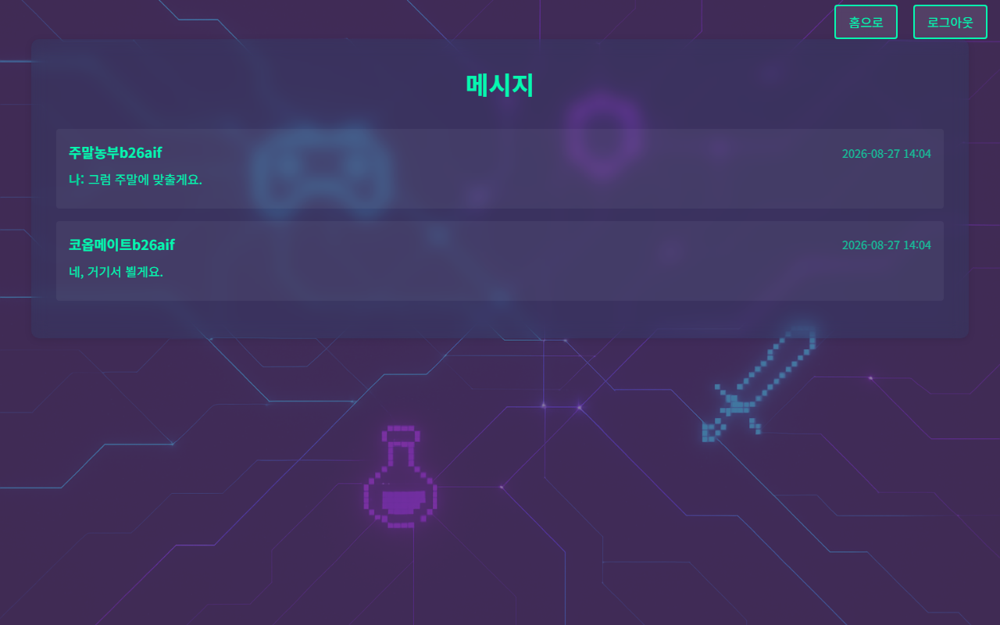
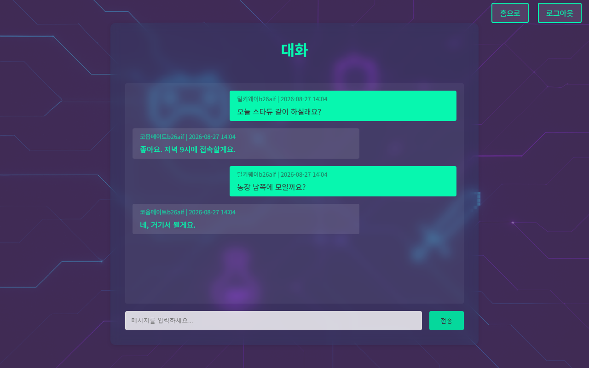

[주요기능 메인으로 돌아가기](./02-features.md)

## 2.5 WebSocket을 통한 실시간 알림 및 STOMP 사용자별 라우팅
 HTTP 기반 메시징에 **WebSocket(STOMP)** 을 결합하여, 메시지 저장 성공 후 수신자에게 실시간 알림을 push합니다.
  
  
**설계 의도**
- HTTP 폴링 방식의 불필요한 네트워크 오버헤드를 제거하고, 양방향 실시간 알림 구현
- STOMP 프로토콜의 구독(Subscribe) 기반 라우팅으로 사용자별 알림을 정확히 전달
- WebSocket 연결에도 JWT 인증을 적용하여 보안 일관성 유지
- 메시지 본문 전송은 기존 HTTP API를 유지하고, STOMP는 알림 push 전용으로 역할 분리
 

 

 
대화 목록·본문은 HTTP로 조회·저장하고, WebSocket은 아래 알림만 담당합니다.
 
 

**WebSocket 구성**
| 설정 | 값 | 설명 |
|------|-----|------|
| STOMP 엔드포인트 | `/ws-nearby-gamers` | WebSocket 핸드셰이크 진입점 |
| 메시지 브로커 | `/queue`, `/topic` | 1:1 큐, 브로드캐스트 토픽 |
| 애플리케이션 접두사 | `/app` | 클라이언트 → 서버 메시지 경로 |
| 유저 접두사 | `/user` | 사용자별 개인 큐 라우팅 |
| Fallback | SockJS | WebSocket 미지원 브라우저 대응 |

 

**메시지·알림 라우팅 흐름**  
[발신자 → 서버] :  
HTTP `POST /messages/send` → `MessageController` → `MessageService.sendMessage`: DB 저장 → 트랜잭션 **afterCommit** 훅에서 `SimpMessagingTemplate.convertAndSendToUser(receiverUsername, "/queue/notifications", payload)` 로 발행

[수신자 ← 서버] :  
STOMP SUBSCRIBE `/user/{username}/queue/notifications` → 구독 중인 수신자에게 실시간 알림 도착

**알림 페이로드** (`NotificationDTO`)
| 필드 | 설명 | 예시 |
|------|------|------|
| `type` | 알림 종류 | `"MESSAGE"` |
| `message` | 사용자에게 보여줄 문구 | `"새 메시지가 도착했습니다."` |
| `data` | 부가 정보 (발신자 닉네임) | `"플레이어닉네임"` |

 
수신 브라우저에 `[MESSAGE] 새 메시지가 도착했습니다. (플레이어: 닉네임)` 형태의 알림이 표시됩니다.
 
 

**트랜잭션 안전성**
- 알림은 DB 커밋이 성공한 뒤에만 발행 (`TransactionSynchronization.afterCommit`)
- 롤백 시에는 afterCommit이 호출되지 않으므로 알림이 나가지 않음
- 브로커 발행 실패는 try/catch로 격리하여 HTTP 응답·메시지 저장에 영향 없음

**WebSocket JWT 인증 처리**  
[STOMP CONNECT 단계] → WebSocketAuthChannelInterceptor.preSend() 실행 → Authorization 헤더(또는 핸드셰이크 쿠키)에서 access token 추출 → Redis 블랙리스트 확인 → 무효화 토큰이면 연결 거부 → JwtTokenUtil로 서명 + 만료 검증 → UserDetailsService로 사용자 조회 → SecurityContext + StompHeaderAccessor에 인증 정보 설정(principal 이름 = username) → 인증 실패 시 WebSocket 연결 자체를 차단

**기술적 특징**
- `ChannelInterceptor`를 활용한 STOMP 레벨 JWT 인증 (HTTP 필터와 분리된 별도 보안 계층)
- `/user` 접두사로 Spring이 자동으로 사용자별 큐를 생성/관리 (`convertAndSendToUser`의 user 키 = username)
- SockJS Fallback으로 WebSocket 미지원 환경 대응
- HTTP 인증(JwtAuthenticationFilter)과 WebSocket 인증(WebSocketAuthChannelInterceptor)이 동일한 `JwtTokenUtil` + `TokenService`를 공유 → 인증 로직 일관성 보장
